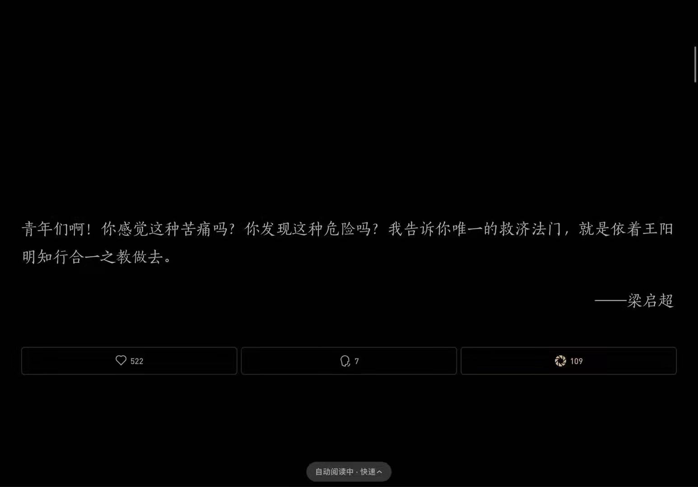

---
title: ARTS003
date: 2021-11-06 14:22:12
tags: ARTS
categories: ARTS
cover: /img/75960.jpg

---

```tex
每周至少做一个leetcode 的算法题、阅读并点评至少一篇英文技术文章、学习至少一个技术技巧、分享一篇有观点和思考的技术文章。（也就是 Algorithm、Review、Tip、Share 简称 ARTS）
```

## Algorithm

```java
# T500 键盘行
class Solution {    
    public String[] findWords(String[] words) {
        List<String> list = new ArrayList<String>();
        String rowIdx = "12210111011122000010020202";
        for (String word : words) {
            boolean isValid = true;
            char idx = rowIdx.charAt(Character.toLowerCase(word.charAt(0)) - 'a');
            for (int i = 1; i < word.length(); ++i) {
                if (rowIdx.charAt(Character.toLowerCase(word.charAt(i)) - 'a') != idx) {
                    isValid = false;
                    break;
                }
            }
            if (isValid) {
                list.add(word);
            }
        }
        String[] ans = new String[list.size()];
        for (int i = 0; i < list.size(); ++i) {
            ans[i] = list.get(i);
        }
        return ans;
    }
}
```

## Review

[Idea官网的文档](https://www.jetbrains.com/help/idea/your-first-spring-application.html#add-home-page)

复习了一下Java开发，Idea确实是一个很成功的ide！

## Tip

这周没有什么技术技巧，只有周末想了想最近的事情，并手写了一点点随想，主要是觉得自己的有效学习和时间管理方面要加强，另外对我来说比较新，或者说较少接触的技术知识也要挤时间学。



在一个群里看得了这个图片，烂道理谁都懂，但是很多人都是思想上的巨人，行动上的侏儒，谁又能免俗呢，我也一样。知行合一是一个很nice的方法论，要坚持，要扎实。希望自己继续坚持ARTS。

## Share

[一个开发者的Linux机器](https://dev.to/deepu105/my-sleek-and-modern-linux-development-machine-in-2021-2d8f)
